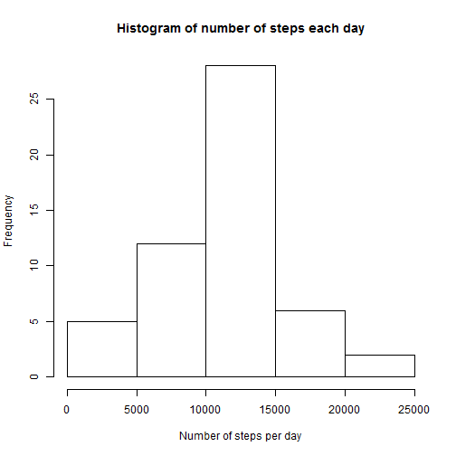
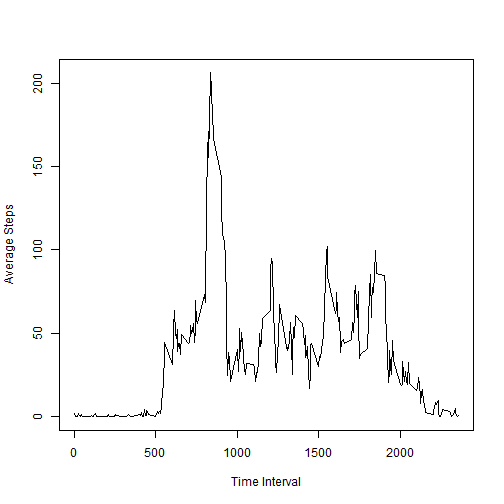
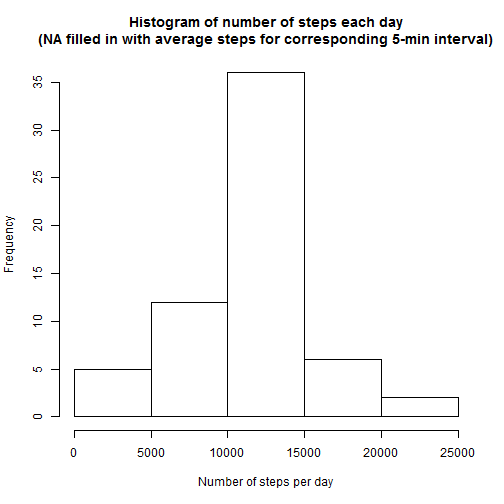

###Loading and preprocessing the data

**Assumptions:-** we are already in the current working directory which contains "activity.csv"


```r
#Load data
activity <- read.csv(file="activity.csv", header = TRUE)

#Process data - calculate sum
totalsteps_per_day <- aggregate(steps ~ date,data=activity,sum,na.rm=TRUE)
names(totalsteps_per_day)=c("date","steps")
```

###What is the mean total number of steps taken per day?

1. Histogram plot 


```r
hist(totalsteps_per_day$steps,main="Histogram of number of steps each day", xlab="Number of steps per day")
```

 

2. The **MEAN** and **MEDIAN** number of steps taken each day is

```r
#Calculate mean
mean_totalsteps_per_day <- mean(totalsteps_per_day$steps)
cat("MEAN number of steps:",mean_totalsteps_per_day)
```

```
## MEAN number of steps: 10766.19
```

```r
#Calculate median
median_totalsteps_per_day <- median(totalsteps_per_day$steps)
cat("MEDIAN number of steps:",median_totalsteps_per_day)
```

```
## MEDIAN number of steps: 10765
```

##What is the average daily activity pattern?

1. Time series plot

```r
#Plot average interval steps over number of days against time interval
interval_average <- aggregate(steps ~ interval,data=activity,mean,na.rm=TRUE)
plot(interval_average$interval,interval_average$steps,type="l",ylab="Average Steps",xlab="Time Interval")
```

 

2.  The 5-minute interval, on average across all the days in the dataset, contains the maximum number of steps is

```r
#Maximum interval that contains the maximum average number of steps
interval_average[which.max(interval_average$steps),1]
```

```
## [1] 835
```

##Imputting missing values

1. Total number of missing values in the dataset (i.e. the total number of rows with NAs)

```r
sum(is.na(activity))
```

```
## [1] 2304
```

2. Strategy for filling in all of the missing values in the dataset:
  + Find the steps with value "NA". Get corresponding interval value and store in variable *interval_step_na*
  + Replace the steps with value "NA" with the average step value for that interval.

3. Create the dataset with R-commands using above-mentioned stategy:


```r
#Find list of corresponding intervals for steps with NA
interval_step_na <- is.na(activity$steps)

#Replace steps with NA with the average number steps of the corresponding interval
activity[interval_step_na,"steps"]<-interval_average[interval_average$interval %in% activity[interval_step_na,"interval"],"steps"]
```

4. Make a histogram of the total number of steps taken each day and report the mean and median total number of steps taken per day


```r
#Calculate the new total steps per day of the filled in data
filled_totalsteps_per_day <- aggregate(steps ~ date,data=activity,sum)

#Plot histogram
hist(filled_totalsteps_per_day$steps,main="Histogram of number of steps each day\n(NA filled in with average steps for corresponding 5-min interval)", xlab="Number of steps per day")
```

 

```r
#Calculate "filled in"" mean
mean_filled_totalsteps_per_day <- mean(filled_totalsteps_per_day$steps)
cat("MEAN number of steps:",mean_filled_totalsteps_per_day)
```

```
## MEAN number of steps: 10766.19
```

```r
#Calculate "filled in"median
median_filled_totalsteps_per_day <- median(filled_totalsteps_per_day$steps)
cat("MEDIAN number of steps:",median_filled_totalsteps_per_day)
```

```
## MEDIAN number of steps: 10766.19
```

* The mean does not differ from the estimates from the first part of the assignment

* The median changes from 10765 to 1.0766189 &times; 10<sup>4</sup>

###Are there differences in activity patterns between weekdays and weekends?

1. Create a new factor variable in the dataset with two levels - "weekday" and "weekend" indicating whether a given date is a weekday or weekend day.

```r
#Assume weekend is Saturday and Sunday
#Use weekdays() to convert date to days of week
#Then factor days into weekdays and weekend
activity$week <- as.factor(ifelse(weekdays(as.POSIXct(as.character(activity$date))) %in% c("Saturday","Sunday"),"Weekend","Weekday"))
```

2. Make a panel plot containing a time series plot (i.e. type = "l") of the 5-minute interval (x-axis) and the average number of steps taken, averaged across all weekday days or weekend days (y-axis).


```r
#Calculate mean number of steps and grouped by interval and weekday/weekend
average_steps <- aggregate(steps ~ interval + week, data=activity, mean)

#Plot average step against interval for weekday/weekend
library(lattice)
xyplot(steps ~ interval | week, data=average_steps, type ="l", layout = c(1,2),xlab="Interval",ylab="Number of steps" )
```

 

* During the weekday peak number of steps occur at interval 835 while the peak during weekend occurs at 915. The weekday peak may be due to subject walking to work at during that interval while during the weekend subject may have gotten up later.

* Subject has higher number of average steps taken across the interval during the weekend when compared to the weekday. This suggests subject walks/runs more during the weekend while during the weekday subject moves less. Subjects may be working during weekday which involves more sitting
